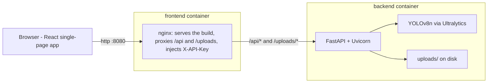
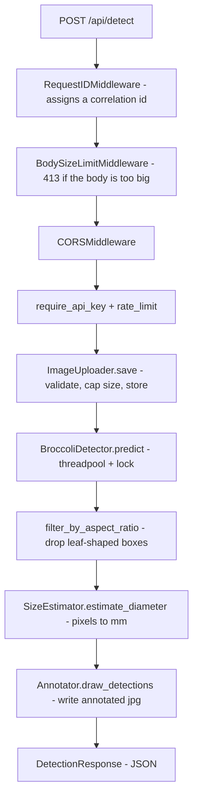

# BroccoliDetect

> Find broccoli crowns in field photos with a YOLOv8n model, and estimate the
> real-world diameter of each crown.

**Deliverable D - Applied AI Minor, Group B4**
**Inholland University of Applied Sciences, Haarlem**
**Client: Robotics | Smart Farming, Inholland Alkmaar**

BroccoliDetect is the interactive web interface for a YOLOv8n object-detection
model the team trained in Deliverable B. A user uploads a top-down field photo;
the backend runs the model, draws boxes around each crown, converts the box
sizes to millimetres with a pinhole-camera model, and returns an annotated
image plus a per-crown size breakdown.

---

## Contents

- [What it does](#what-it-does)
- [Architecture at a glance](#architecture-at-a-glance)
- [Project structure](#project-structure)
- [Running it](#running-it)
- [Configuration](#configuration)
- [Features](#features)
- [API reference](#api-reference)
- [How crown size is calculated](#how-crown-size-is-calculated)
- [Coding principles](#coding-principles)
- [Testing](#testing)
- [Deployment](#deployment)
- [Tech stack](#tech-stack)
- [Known limits & future work](#known-limits--future-work)
- [Where to look first](#where-to-look-first-for-new-engineers)
- [Team & licence](#team--licence)

---

## What it does

1. The user uploads a broccoli field photo (JPG or PNG) on the **Upload** page.
2. The backend validates and stores the image, then runs the trained YOLOv8n
   model on it.
3. Boxes that are too elongated to be a crown (probably leaves) are optionally
   filtered out.
4. Each remaining box is converted from pixels to a real-world diameter in
   millimetres using a pinhole-camera model and the camera height set in
   **Settings**.
5. The backend draws green boxes on a copy of the image and returns JSON.
6. The **Results** page shows the annotated image, a summary, and a list of
   every crown with its size and confidence.

---

## Architecture at a glance

Two containers. The frontend container (nginx) serves the built React app and
reverse-proxies API and image requests to the backend container (FastAPI +
Uvicorn). This single origin keeps the browser free of CORS concerns and lets
nginx inject the backend API key server-side, so the browser never sees it.



In **local development** there are no containers: the Vite dev server (port
5173) serves the React app with hot reload and proxies `/api` and `/uploads`
to a locally running Uvicorn (port 8000), mirroring the nginx setup.

A single `POST /api/detect` request flows through a chain of ASGI middleware
and then a pipeline of small services:



---

## Project structure

```
broccoli-detector-D/
├── backend/                      # FastAPI + YOLOv8n API (Python 3.11)
│   ├── app/
│   │   ├── main.py               # App entry: middleware, lifespan, routers
│   │   ├── config.py             # Single source of truth for all settings
│   │   ├── api/
│   │   │   ├── detect.py         # POST /api/detect (auth + rate limit + pipeline)
│   │   │   └── health.py         # GET /api/health and /api/ready
│   │   ├── services/
│   │   │   ├── detector.py       # YOLOv8n wrapper (load, integrity check, predict)
│   │   │   ├── uploader.py       # Upload validation + safe save
│   │   │   ├── detection_filters.py  # Aspect-ratio (leaf) filter
│   │   │   ├── size_estimator.py # Pinhole-camera mm conversion
│   │   │   ├── annotator.py      # Draws boxes/labels on the result image
│   │   │   └── rate_limiter.py   # In-memory sliding-window limiter
│   │   └── models/schemas.py     # Pydantic request/response models
│   ├── weights/best.pt           # Trained model (committed; ~6 MB)
│   ├── uploads/                  # Saved + annotated images (runtime, swept)
│   ├── Dockerfile
│   └── requirements.txt
├── frontend/                     # React + Vite + Tailwind
│   ├── src/
│   │   ├── App.jsx               # Routing, shared state, ErrorBoundary
│   │   ├── main.jsx              # React entry point
│   │   ├── pages/                # Home, Upload, Results, Settings, About
│   │   ├── components/           # Header, BottomNav, ErrorBoundary
│   │   ├── api/client.js         # Single place for all backend calls
│   │   ├── constants/            # model.js, upload.js (single-sourced literals)
│   │   ├── utils/number.js       # clampNumber (settings sanitisation)
│   │   └── *.test.jsx            # Vitest + Testing Library suites
│   ├── Dockerfile                # Multi-stage: node build -> nginx serve
│   ├── nginx.conf.template       # Rendered at container start (envsubst)
│   ├── vite.config.js            # Dev server + /api proxy
│   └── package.json
├── docs/size-estimation.md       # Deep dive on the mm conversion
├── docker-compose.yml            # Run both services together
├── render.yaml                   # Render Blueprint (cloud deploy)
├── .env.example                  # Copy to .env; documents every backend var
└── README.md                     # You are here
```

---

## Running it

### Option A - Docker Compose (recommended)

You need Docker Desktop. The trained model ships in the repo at
`backend/weights/best.pt`, so the app is ready as-is.

```bash
# 1. Create your local env file (docker-compose reads .env).
cp .env.example .env

# 2. Build and start both services.
docker compose up --build
```

Then open:

- **App (frontend):** http://localhost:8080
- **API docs (dev only):** http://localhost:8000/docs

This builds on both Apple Silicon (arm64) and Intel (x86_64) - pip pulls the
matching CPU PyTorch wheel for whichever chip Docker is building on.

To exercise the authenticated path locally, start with a key set:

```bash
API_KEY=dev-secret docker compose up --build
```

### Option B - Local dev (hot reload)

**Backend (Python 3.11+):**

```bash
cd backend
python3.11 -m venv .venv
source .venv/bin/activate            # Windows: .venv\Scripts\activate
pip install -r requirements.txt
uvicorn app.main:app --reload --port 8000
```

API at http://localhost:8000, docs at http://localhost:8000/docs.

**Frontend (Node.js 20+):** in a second terminal:

```bash
cd frontend
npm install
npm run dev
```

UI at http://localhost:5173. The Vite dev server proxies `/api` and `/uploads`
to the backend, so no extra config is needed.

> No weights file? The backend still boots if you set `ALLOW_MISSING_WEIGHTS=1`,
> so you can work on the frontend. `/api/detect` then returns 503 until
> `best.pt` is present.

---

## Configuration

All backend settings are centralised in
[`backend/app/config.py`](backend/app/config.py) and read **once** at startup.
Environment-overridable variables are documented in
[`.env.example`](.env.example):

| Variable | Default | Purpose |
| --- | --- | --- |
| `API_KEY` | _(empty)_ | If set, `/api/detect` requires it in the `X-API-Key` header. Empty = auth disabled (local dev). |
| `RATE_LIMIT_MAX` | `10` | Max `/api/detect` calls per client IP per window. |
| `RATE_LIMIT_WINDOW_SECONDS` | `60` | Length of the rate-limit window. |
| `DEPLOY_ENV` | `dev` | `production` hides `/docs`, `/redoc`, `/openapi.json`. |
| `CORS_ALLOW_ORIGINS` | `localhost:5173,8080` | Comma-separated browser-origin allowlist. |
| `UPLOAD_TTL_SECONDS` | `3600` | Delete saved images older than this. |
| `UPLOAD_SWEEP_SECONDS` | `600` | How often the retention sweep runs. |
| `LOG_LEVEL` | `INFO` | `DEBUG` / `INFO` / `WARNING` / `ERROR`. |
| `EXPECTED_WEIGHTS_SHA256` | _(unset)_ | If set, `best.pt` is hashed and must match before load. |
| `ALLOW_MISSING_WEIGHTS` | _(unset)_ | `1` lets the server start without `best.pt` (frontend dev). |

Non-environment tunables (request/file size caps, confidence defaults and
bounds, camera-height bounds, FOV, size-category thresholds) also live in
`config.py` as plain constants - change them in one place.

---

## Features

### Detection & size estimation
- **One-shot model load.** The YOLOv8n model loads once at startup and is held
  on `app.state`, so no request pays the load cost.
- **Leaf filter.** Optionally drops boxes whose longer/shorter side ratio
  exceeds `1.6` (usually leaves, not crowns). Toggle in Settings.
- **Pinhole size estimate.** Converts box pixels to millimetres from the camera
  height; assigns a `small` / `medium` / `large` retail grade. See
  [docs/size-estimation.md](docs/size-estimation.md).
- **Server-side annotation.** Boxes and labels are drawn on the backend, so the
  frontend just shows one ``.

### Frontend UX
- **Five pages:** Home, Upload, Results, Settings, About, with a fixed bottom
  nav (mobile-first, matches the Deliverable C wireframes).
- **Dark mode with no flash.** An inline script in
  [`index.html`](frontend/index.html) applies the saved theme before first
  paint, so dark-mode users never see a white flash.
- **Persistent settings & results.** Camera height, confidence, leaf-filter and
  theme persist in `localStorage`; the last detection survives a reload via
  `sessionStorage`.
- **Cancellable, self-unsticking uploads.** Detection requests can be cancelled,
  and a 60 s watchdog aborts a stuck request so the button never hangs.
- **Crash-safe.** A React `ErrorBoundary` around the routes shows a friendly
  fallback instead of a blank screen; `Results` defends against malformed
  payloads.
- **Keyboard accessible.** The drop zone is a real `<label>`/input (focusable,
  Enter/Space opens the picker); crown rows are `role="button"` with
  `aria-expanded` and Enter/Space toggling.

### Security & robustness (the backend is internet-facing)
- **Optional API-key auth** on `/api/detect`, enforced only when `API_KEY` is
  set, compared in constant time.
- **Per-IP rate limiting** (sliding window) returns `429` with `Retry-After`.
- **Layered upload defence:** request-body cap (`413`), streamed file-size cap,
  decompression-bomb pixel cap, real-image decode check, and a saved filename
  derived from the *decoded* format (never the user-supplied name).
- **Weights integrity check.** If `EXPECTED_WEIGHTS_SHA256` is set, `best.pt` is
  hashed and compared *before* `torch.load` unpickles it, rejecting a tampered
  checkpoint.
- **CORS allowlist**, credentials off, methods/headers narrowed.
- **Security headers + gzip + long-cache for fingerprinted assets** at the nginx
  layer (CSP, `nosniff`, `X-Frame-Options: DENY`, `Referrer-Policy`).
- **Non-root container.** The backend image runs as an unprivileged user.
- **Docs gated** behind `DEPLOY_ENV=production`.
- **Disk bounded.** A background sweep deletes uploaded/annotated images older
  than the TTL.

### Observability
- **Structured logging** (levels, timestamps, logger names) replaces `print`.
- **Request correlation.** Every response carries an `X-Request-ID`; the same id
  prefixes every log line for that request and is surfaced in client errors so a
  user can quote it.
- **Health & readiness.** `/api/health` is cheap (used by the platform
  healthcheck and returns `503` when the model is not loaded); `/api/ready` also
  verifies the uploads dir is writable.

---

## API reference

| Method | Path | Description |
| --- | --- | --- |
| `GET` | `/api/health` | Liveness + model check. `200` when ready, `503` when the model is not loaded. |
| `GET` | `/api/ready` | Deeper readiness: model loaded **and** uploads dir writable. |
| `POST` | `/api/detect` | Run detection on an uploaded image (auth + rate-limited). |
| `GET` | `/uploads/...` | Serves saved original and annotated images. |
| `GET` | `/docs` | Swagger UI (dev only; hidden in production). |

### `POST /api/detect`

Multipart form fields:

| Field | Type | Default | Bounds |
| --- | --- | --- | --- |
| `file` | file | _required_ | JPG or PNG |
| `camera_height_mm` | float | `1000` | `100 < x < 5000` |
| `conf_threshold` | float | `0.40` | `0.10`–`0.95` |
| `aspect_ratio_filter` | bool | `true` | - |

```bash
curl -X POST http://localhost:8000/api/detect \
  -F "file=@field_image.jpg" \
  -F "camera_height_mm=1000" \
  -F "conf_threshold=0.40" \
  -F "aspect_ratio_filter=true"
# Add -H "X-API-Key: <key>" when API_KEY is configured.
```

Response:

```json
{
  "image_id": "a3b8c1d2e4f5",
  "image_url": "/uploads/a3b8c1d2e4f5.jpg",
  "annotated_url": "/uploads/a3b8c1d2e4f5_annotated.jpg",
  "image_width": 1280,
  "image_height": 720,
  "crowns": [
    {
      "crown_id": 1,
      "bbox": { "x1": 540, "y1": 270, "x2": 660, "y2": 380 },
      "confidence": 0.94,
      "diameter_mm": 119.5,
      "diameter_cm": 11.95,
      "size_category": "medium"
    }
  ],
  "num_crowns": 1,
  "inference_time_ms": 187.3,
  "camera_height_mm": 1000.0,
  "conf_threshold": 0.40,
  "aspect_ratio_filter": true,
  "num_filtered": 0
}
```

---

## How crown size is calculated

A simple pinhole-camera model (full walkthrough in
[docs/size-estimation.md](docs/size-estimation.md)):

```
ground_width_mm = 2 * camera_height_mm * tan(FOV_horizontal / 2)
mm_per_pixel     = ground_width_mm / image_width_px
diameter_mm      = avg(bbox_width_px, bbox_height_px) * mm_per_pixel
```

| Parameter | Value | Source |
| --- | --- | --- |
| Camera height | `1000 mm` | Adjustable in Settings (`100`–`5000`) |
| Horizontal FOV | `69.4°` | Intel RealSense D415 datasheet |
| Image width | from upload | Read at runtime |

The box width and height are averaged because crowns are roughly circular from
above. The estimate is **linear in camera height** - telling the app the true
height is what makes it accurate.

**Why no depth?** The dataset the team received contains only the RGB JPGs of
the original RGB-D capture. Without per-pixel depth, a fixed-height assumption
is the simplest reasonable fallback.

---

## Coding principles

A few conventions a new engineer should keep following:

- **Single source of truth.** Backend settings live only in
  [`config.py`](backend/app/config.py); frontend literals (model metrics, upload
  limits) live in [`frontend/src/constants/`](frontend/src/constants/). Don't
  restate a value - import it.
- **Thin routes, small services.** HTTP handlers orchestrate; the real work
  lives in single-purpose, independently testable services
  (`detector`, `uploader`, `size_estimator`, `detection_filters`, `annotator`).
- **Dependency injection.** The route receives its `ImageUploader` and
  `SizeEstimator` via FastAPI `Depends`, so tests can swap them with
  `app.dependency_overrides`.
- **Pure functions where possible.** e.g. `filter_by_aspect_ratio` takes plain
  dicts and returns a new list - trivial to unit-test.
- **Concurrency is explicit.** CPU-bound inference runs in a threadpool; the
  non-thread-safe YOLO model and the shared rate-limiter state are guarded with
  locks.
- **One API client on the frontend.** All `fetch` calls go through
  [`src/api/client.js`](frontend/src/api/client.js): it checks `response.ok`
  before parsing, builds error messages (with the request-id ref), and logs
  failures once, dev-only.
- **Comments explain "why", not "what."** Keep that style; avoid narrating the
  obvious.
- **Fail loud on misconfig, degrade gracefully on missing optionals.** A missing
  model crashes a production boot (unless `ALLOW_MISSING_WEIGHTS`), but a missing
  optional setting falls back to a safe default.

---

## Testing

The frontend has a [Vitest](https://vitest.dev) + Testing Library suite covering
the API client, settings clamping, the error boundary, defensive rendering,
keyboard accessibility, single-sourced constants, dark-mode FOUC prevention, and
the upload abort/timeout flow.

```bash
cd frontend
npm test                 # or: npm run test
```

Zero-install option (run in a throwaway Node container):

```bash
docker run --rm -v "$PWD/frontend":/app -w /app node:20-alpine \
  sh -c "npm ci && npm run test"
```

> The backend does not yet ship an automated test suite; changes have been
> verified with targeted throwaway scripts. Adding a `pytest` suite (the service
> layer is structured for it) is the most valuable next testing step.

---

## Deployment

Cloud deploys use [`render.yaml`](render.yaml) (a Render Blueprint) - two Docker
web services, `broccoli-backend` and `broccoli-frontend`. Notable points a
future maintainer needs to know:

- **API key** is generated by Render on the backend and pulled into the frontend
  via `fromService`, so the two stay in sync; nginx injects it as `X-API-Key`.
- **Frontend -> backend over the public URL.** nginx's `resolver` can't use
  Render's private DNS, so the frontend proxies to the backend's public
  `*.onrender.com` host. That host is **hardcoded** in `render.yaml`
  (`BACKEND_HOST`); if the backend is renamed/recreated, update those values or
  the frontend will proxy to a dead host (502).
- **`DEPLOY_ENV=production`** hides the API docs.
- **`EXPECTED_WEIGHTS_SHA256`** is set so a tampered checkpoint is rejected.
  Update it whenever the model is retrained.
- **Free tier caveat.** YOLO inference needs more CPU than Render's free/starter
  tiers comfortably provide; for an interactive demo, run locally with
  `docker compose up`. The single Uvicorn process is intentional - see the
  rationale in [`backend/Dockerfile`](backend/Dockerfile).

---

## Tech stack

| Layer | Technology | Version |
| --- | --- | --- |
| Frontend | React + Vite + Tailwind | React 18.3 / Vite 5.4 |
| Routing | React Router | 6.26 |
| Icons | lucide-react | 0.441 |
| Frontend tests | Vitest + Testing Library + jsdom | Vitest 2.1 |
| Backend | FastAPI + Uvicorn | 0.115 / 0.30 |
| Model | Ultralytics YOLOv8 | 8.2.103 |
| Deep learning | PyTorch (CPU) | 2.2.2 |
| Image processing | Pillow + OpenCV (headless) + NumPy | 10.4 / 4.10 / 1.26 |
| Validation | Pydantic | 2.9 |
| Containers | Docker + Docker Compose | - |
| Cloud | Render (Blueprint) | - |

The model shown in the UI: **YOLOv8n**, ~3.0M parameters, reported
**mAP@0.5 = 0.976** and **mean IoU = 0.916** on 27 unseen test images from
Deliverable B (surfaced from
[`frontend/src/constants/model.js`](frontend/src/constants/model.js)).

---

## Known limits & future work

**Limits**
- Camera height is assumed constant and the camera vertical; a tilted or
  moved camera skews the size estimate.
- No lens-distortion correction; crowns near the corners read slightly small.
- One image per request (no batch upload).
- Small training set, so precision in the field is limited - more annotated
  data would help.
- Rate-limit and retention state are per-process (fine for the single-worker
  PoC; a multi-instance setup needs a shared store such as Redis).

**Future work**
- Use the original RGB-D depth data instead of the fixed-height assumption.
- Growth tracking across photos of the same field over time.
- Batch uploads and CSV export of detections.
- A backend `pytest` suite.

---

## Where to look first (for new engineers)

| If you want to... | Start in |
| --- | --- |
| Understand startup, middleware, lifespan | [`backend/app/main.py`](backend/app/main.py) |
| Change a limit, default, or threshold | [`backend/app/config.py`](backend/app/config.py) |
| Follow the detection request end-to-end | [`backend/app/api/detect.py`](backend/app/api/detect.py) |
| Touch the model itself | [`backend/app/services/detector.py`](backend/app/services/detector.py) |
| Change the size math | [`backend/app/services/size_estimator.py`](backend/app/services/size_estimator.py) + [`docs/size-estimation.md`](docs/size-estimation.md) |
| Work on UI pages | [`frontend/src/pages/`](frontend/src/pages/) |
| Change how the UI calls the API | [`frontend/src/api/client.js`](frontend/src/api/client.js) |
| Adjust the proxy / headers / caching | [`frontend/nginx.conf.template`](frontend/nginx.conf.template) |

---

## Team & licence

**Group B4:** Alaa Aldrobe, Manol Draganov, Diego Baez de la Cruz,
Rienat Zhuravlov, Fatmanur Vardar.

This project is part of the Applied AI Minor at Inholland University of Applied
Sciences and is shared with the Professorship Robotics | Smart Farming.
